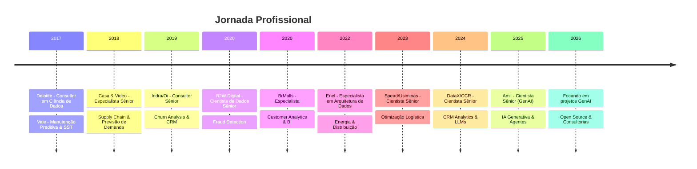

<div align="center">

# 👋 Olá, sou Vinicius de Sousa

### 🤖 Cientista de Dados Sênior | Especialista em GenAI & LLMs

[](https://git.io/typing-svg)

<br>

[](https://www.linkedin.com/in/vinicius-deolindo-83631148/)
[](mailto:viniciusds1020@gmail.com)
[](https://github.com/viniciusds2020)

</div>

---

## 🎯 Sobre Mim

```python
class ViniciusDeSousa:
    def __init__(self):
        self.role = "Senior Data Scientist"
        self.specialization = ["GenAI", "LLMs", "MLOps", "Computer Vision"]
        self.location = "Niterói, RJ - Brasil"
        self.experience_years = 7
        
    def current_focus(self):
        return {
            "🔥 Trabalhando com": [
                "Fine-tuning de LLMs (LoRA, QLoRA)",
                "Arquiteturas Multiagentes com LangChain",
                "RAG (Retrieval-Augmented Generation)",
                "Sistemas de Semantic Search",
                "MLOps com Azure/Databricks"
            ],
            "🎓 Aprendendo": [
                "Advanced Prompt Engineering",
                "Multi-modal AI (GPT-4V, Gemini Vision)",
                "Vector Databases (Pinecone, Weaviate)",
                "LLM Evaluation & Monitoring"
            ],
            "💼 Aberto para": [
                "Projetos desafiadores em GenAI",
                "Consultorias especializadas",
                "Colaborações open-source"
            ]
        }
    
    def impact_metrics(self):
        return {
            "cost_reduction": "R$ 2M+ /ano",
            "time_saved": "70% em processamento",
            "automation": "85% de tarefas manuais",
            "accuracy": "92% em modelos críticos"
        }
```

---

## 🌟 Destaques Profissionais

### 💡 **Experiência Recente que Faz Diferença:**

🏥 **Sistema de IA Generativa para Healthcare (Amil - 2025)**
- Arquitetura multiagente com **LLMs multimodais** (Gemini, GPT-4) + **SLMs** (Llama 3, Gemma)
- **Fine-tuning com LoRA** para classificação e extração de documentos TISS
- Integração **Azure Document Intelligence** + OCR híbrido (PaddleOCR)
- **Resultado:** ⚡ 70% redução tempo | 💰 R$ 2M economia/ano | 🎯 92% accuracy

📊 **Plataforma de CRM Analytics (DataX/CCR - 2024-2025)**
- **Chatbot inteligente** com LLaMA 2 + fine-tuning para análises self-service
- Modelos de **churn prediction** em 5M+ clientes (83% accuracy)
- Pipelines escaláveis em **Azure Databricks** + MLflow
- **Resultado:** ⏱️ 40% menos tempo em consultas | 💎 ROI 4.5x em retenção

🏭 **Otimização Logística com AutoML (Usiminas - 2023-2024)**
- **AutoML para roteirização ferroviária** e alocação de carga
- Deploy em produção com **FastAPI** + monitoramento MLflow
- **Resultado:** 🚂 18% melhoria na malha | 💰 R$ 8M economia/ano

---

## 🛠️ Stack Tecnológico

### 🤖 **IA Generativa & LLMs** (Especialização Principal)


```
🎯 LLMs: OpenAI GPT-4, Google Gemini, Anthropic Claude, Meta Llama 3, Gemma
🔧 Fine-tuning: LoRA, QLoRA, PEFT, Transformers
🧠 Frameworks: LangChain, LlamaIndex, Haystack
🔍 Técnicas: Prompt Engineering, RAG, Agentic AI, Few-shot Learning
📊 Embeddings: OpenAI, Sentence Transformers, CLIP (multimodal)
```

### ☁️ **Cloud & MLOps**


```
☁️ Azure: Databricks, ML Studio, Synapse, Data Factory, Document Intelligence
📊 Databricks: Workflows, MLflow, Delta Lake, Feature Store
🔄 MLOps: Model versioning, A/B testing, monitoring, governance
🐍 Orchestration: Airflow, Azure Data Factory
```

### 🤖 **Machine Learning & Deep Learning**


```
📚 Frameworks: scikit-learn, XGBoost, LightGBM, CatBoost
🧠 Deep Learning: PyTorch, TensorFlow, Keras
👁️ Computer Vision: OpenCV, CLIP, OCR (Tesseract, PaddleOCR, Azure DI)
📝 NLP: spaCy, NLTK, Transformers
```

### 📊 **Big Data & Visualização**


```
🚀 Big Data: Apache Spark, PySpark, Databricks
💾 Databases: PostgreSQL, SQL Server, MySQL, Azure SQL
📊 BI: Power BI, Tableau, Plotly/Dash, Streamlit
```

### 💻 **Linguagens**


---

## 🚀 Projetos em Destaque

### 🔥 [RAG System for Document Q&A](link-quando-disponivel)
Sistema RAG completo com LangChain para Q&A em documentos técnicos
- **Stack:** LangChain, OpenAI GPT-4, Pinecone, FAISS
- **Features:** Chunk optimization, hybrid search, context window management
- **Métricas:** Precisão 87% em respostas técnicas complexas

### 🔍 [E-commerce Semantic Search Engine](link-quando-disponivel)
Motor de busca semântica com embeddings e learning-to-rank
- **Stack:** Elasticsearch, Sentence Transformers, LambdaMART
- **Features:** Query expansion, personalization, A/B testing framework
- **Métricas:** 23% melhoria em NDCG@10, 15% aumento em CTR

### 🤖 [Multi-Agent AI System](link-quando-disponivel)
Arquitetura de agentes especializados com orquestração inteligente
- **Stack:** LangGraph, GPT-4, Llama 3, CrewAI
- **Features:** Task delegation, error handling, human-in-the-loop
- **Use cases:** Data analysis automation, report generation

### 🎯 [LLM Fine-tuning Pipeline](link-quando-disponivel)
Pipeline completo para fine-tuning de LLMs com LoRA/QLoRA
- **Stack:** PyTorch, Transformers, PEFT, Weights & Biases
- **Features:** Hyperparameter search, evaluation metrics, deployment
- **Models:** Llama 3-8B, Gemma-7B para tarefas específicas

> 💡 **Nota:** Projetos em desenvolvimento ativo. Links serão adicionados conforme disponibilização pública.

---

## 📈 Histórico Profissional



---

## 🎓 Formação & Certificações

🎓 **Bacharelado em Estatística** - UERJ (2014)

📜 **Certificações em Progresso:**
- Azure AI Engineer Associate (AI-102)
- Google Cloud Professional ML Engineer
- Advanced LLM Applications (DeepLearning.AI)

📚 **Cursos Relevantes:**
- Machine Learning Specialization (Stanford/Coursera)
- Deep Learning Specialization (deeplearning.ai)
- Big Data Fundamentos (Data Science Academy)
- MLOps Specialization

---

## 💼 Aberto Para Oportunidades

🔍 **Buscando projetos em:**
- 🤖 Desenvolvimento de soluções GenAI/LLMs
- 🏗️ Arquitetura de sistemas de ML em produção
- 📊 Consultoria especializada em ML/AI
- 🚀 Liderança técnica de squads de dados

---

## 📫 Vamos Conectar!

Estou sempre aberto a discutir:
- 💡 Projetos inovadores em IA e Machine Learning
- 🤝 Colaborações em open-source
- 🎯 Oportunidades de consultoria
- 📚 Troca de conhecimentos sobre GenAI/LLMs

<div align="center">

[](https://www.linkedin.com/in/vinicius-deolindo-83631148/)
[](mailto:viniciusds1020@gmail.com)

**⭐ Se você achou meus projetos interessantes, deixe uma estrela!**


</div>

---

<div align="center">
  
  
  ### 🚀 "Transformando dados em valor através de IA" 🚀
  
  <sub>Última atualização: Janeiro 2026</sub>
</div>
