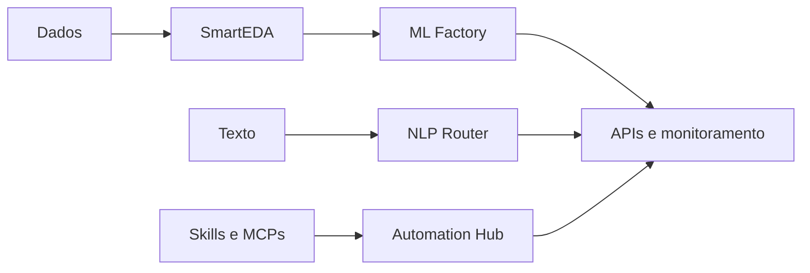

# Vinicius de Sousa

### Senior AI Engineer · Data Scientist · Applied ML & GenAI

Construo sistemas de Inteligência Artificial do protótipo à produção, combinando engenharia de software, estatística, machine learning e automação de processos.

## Sobre mim

Engenheiro de IA e Cientista de Dados Sênior, formado em Estatística pela UERJ, com mais de 10 anos de experiência em projetos de dados, machine learning e inteligência artificial nos setores de saúde, indústria, varejo, energia e serviços.

Transformo problemas de negócio em sistemas confiáveis: da qualidade e governança dos dados ao desenvolvimento, avaliação, implantação e monitoramento de modelos. Meu trabalho recente conecta IA generativa, RAG, agentes, Skills, MCPs, NLP eficiente, automação e plataformas de ML.

## O que construo

- **AI Engineering:** RAG, agentes, Skills, MCPs, LLMs/SLMs, avaliação e guardrails
- **Machine Learning:** classificação, forecasting, ranking, otimização e validação estatística
- **NLP eficiente:** classificação local-first, roteamento seletivo e redução de tokens
- **Data & MLOps:** profiling, experiment tracking, quality gates, APIs e monitoramento de drift
- **Document AI:** OCR, extração estruturada, recuperação híbrida e processamento multimodal
- **Arquitetura:** soluções desacopladas e observáveis em Azure, Databricks e Google Cloud

## Projetos em destaque

| Projeto | Problema resolvido | Engenharia aplicada |
|---|---|---|
| [Enterprise Agent Evaluation Platform](https://github.com/viniciusds2020/enterprise-agent-evaluation-platform) | Compara agentes com qualidade, segurança, custo e significância estatística antes da promoção | Golden datasets, McNemar, bootstrap, Holm, quality gates, FastAPI, Docker e CI |
| [Intelligent Document Decision Engine](https://github.com/viniciusds2020/intelligent-document-decision-engine) | Classifica páginas, extrai campos por schema e produz decisões documentais explicáveis | Document AI, PyMuPDF, schemas YAML, regras, human-in-the-loop, FastAPI, Docker e CI |
| [AI Operations Case Manager](https://github.com/viniciusds2020/ai-operations-case-manager) | Automatiza triagem, planejamento, aprovação e execução auditável de solicitações corporativas | FastAPI, regras explicáveis, human-in-the-loop, Groq/Llama, Skills, SQLite, Docker e CI |
| [AI Automation Hub](https://github.com/viniciusds2020/ai-automation-hub) | Painel visual para organizar Skills, servidores MCP e workflows de automação de IA | FastAPI, SQLite, HTML/CSS/JS, Docker, execução segura e CI |
| [Multi-Agent Orchestration Lab](https://github.com/viniciusds2020/multi-agent-orchestration-lab) | Comparação do mesmo processo multiagente em dois paradigmas de orquestração | CrewAI, LangGraph, Groq/Llama, FastAPI, SQLite e métricas |
| [LangGraph Tool Agent](https://github.com/viniciusds2020/langgraph-tool-agent) | Agente stateful que resolve problemas chamando ferramentas seguras e solicitando aprovação humana | LangGraph, Groq/Llama, tool calling, checkpoints, FastAPI e SQLite |
| [Copilot Document Knowledge Engineering](https://github.com/viniciusds2020/copilot-document-knowledge-engineering) | Transforma PDFs e documentos em conhecimento rastreável e governado para agentes Copilot Studio | Docling, OCRmyPDF, PyMuPDF, FastAPI, Skills, prompts e avaliação |
| [SmartEDA](https://github.com/viniciusds2020/sistema_eda) | Profiling estatístico, qualidade de dados e detecção de drift em datasets de diferentes escalas | Python, pandas, Polars, DuckDB, SciPy e relatórios HTML |
| [ML Classification Factory](https://github.com/viniciusds2020/ml_pycaret_classificacao) | Fábrica reprodutível de modelos com validação, rastreabilidade e promoção controlada | PyCaret, MLflow, FastAPI, quality gates, Docker e CI |
| [Token-Efficient NLP Router](https://github.com/viniciusds2020/nlp_classificacao_texto_spacy) | Classificação de textos local-first com fallback seletivo para reduzir custo e tokens | spaCy, TF-IDF, Logistic Regression, Groq/Llama e FastAPI |
| [Agent Factory](https://github.com/viniciusds2020/agentfactoryupoa) | Plataforma RAG híbrida para documentos corporativos em português | FastAPI, React, FAISS, BM25, Groq, avaliação e guardrails |
| [Busca Semântica para E-commerce](https://github.com/viniciusds2020/sistema_de_busca_semantica) | Recuperação e ranking de produtos combinando sinais lexicais e semânticos | Elasticsearch, embeddings, LightGBM e Learning to Rank |
| [Forecasting de múltiplos produtos](https://github.com/viniciusds2020/sistema_multiplos_forecast) | Previsão de demanda para múltiplos SKUs com agrupamento e rateio por produto | Python, séries temporais, clustering, FastAPI e React |
| [Desafio Aquarela IA](https://github.com/viniciusds2020/desafio_aquarela_ia) | Predição de consumo energético com validação temporal e experimentos rastreáveis | DuckDB, LightGBM, Random Forest e MLflow |

## Ecossistema de soluções

```mermaid
flowchart LR
    D["Dados"] --> E["SmartEDA"]
    E --> M["ML Factory"]
    M --> A["APIs e monitoramento"]
    N["Texto"] --> R["NLP Router"]
    R --> A
    S["Skills e MCPs"] --> H["Automation Hub"]
    H --> A
```

Os projetos formam uma linha de produção: dados são diagnosticados, modelos são treinados com governança, serviços são expostos por APIs e automações coordenam Skills, MCPs e componentes de IA.

## Tecnologias

**Linguagens:** Python · SQL · R · JavaScript · Bash  
**IA e ML:** PyTorch · TensorFlow · scikit-learn · LightGBM · XGBoost · PyCaret · Hugging Face  
**GenAI:** Groq · Llama · CrewAI · LangGraph · LangChain · RAG · agentes · Skills · MCPs  
**Dados e MLOps:** pandas · Polars · DuckDB · Spark · MLflow · PostgreSQL · SQLite  
**Engenharia:** FastAPI · Docker · GitHub Actions · APIs REST · testes automatizados  
**Cloud e visualização:** Azure · Google Cloud · Databricks · Power BI · Plotly · Streamlit

## Princípios de engenharia

- Começar pelo problema, risco e métricas de sucesso
- Criar pipelines reprodutíveis, testáveis e observáveis
- Avaliar qualidade, latência, custo, segurança e explicabilidade
- Preferir componentes desacoplados e reutilizáveis
- Reduzir uso de LLMs quando modelos locais resolvem o problema
- Manter aprovação humana em ações sensíveis

## Direção atual

- automação de processos corporativos com Skills e MCPs;
- agentes com governança, rastreabilidade e observabilidade;
- monitoramento longitudinal de dados e modelos;
- NLP local-first orientado a custo;
- sistemas RAG híbridos para domínios especializados;
- plataformas reutilizáveis de machine learning.

## Contato

Estou aberto a conversas sobre engenharia e arquitetura de IA, liderança técnica, GenAI, MLOps e automação inteligente.

- [LinkedIn](https://www.linkedin.com/in/vinicius-deolindo-83631148/)
- [E-mail](mailto:viniciusds1020@gmail.com)

---

Rio de Janeiro, Brasil · Português nativo · Inglês profissional

